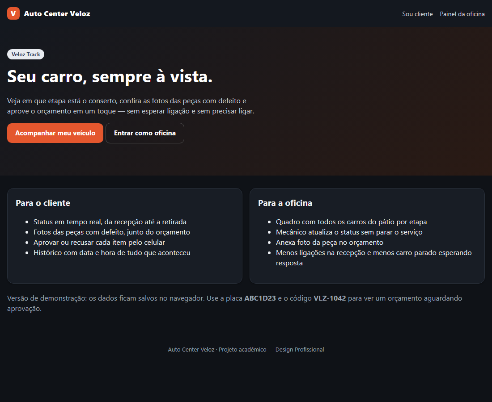
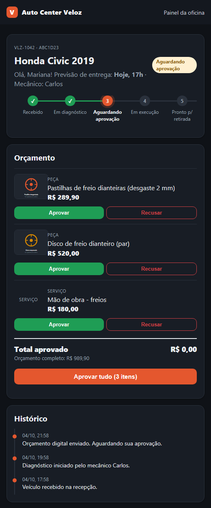
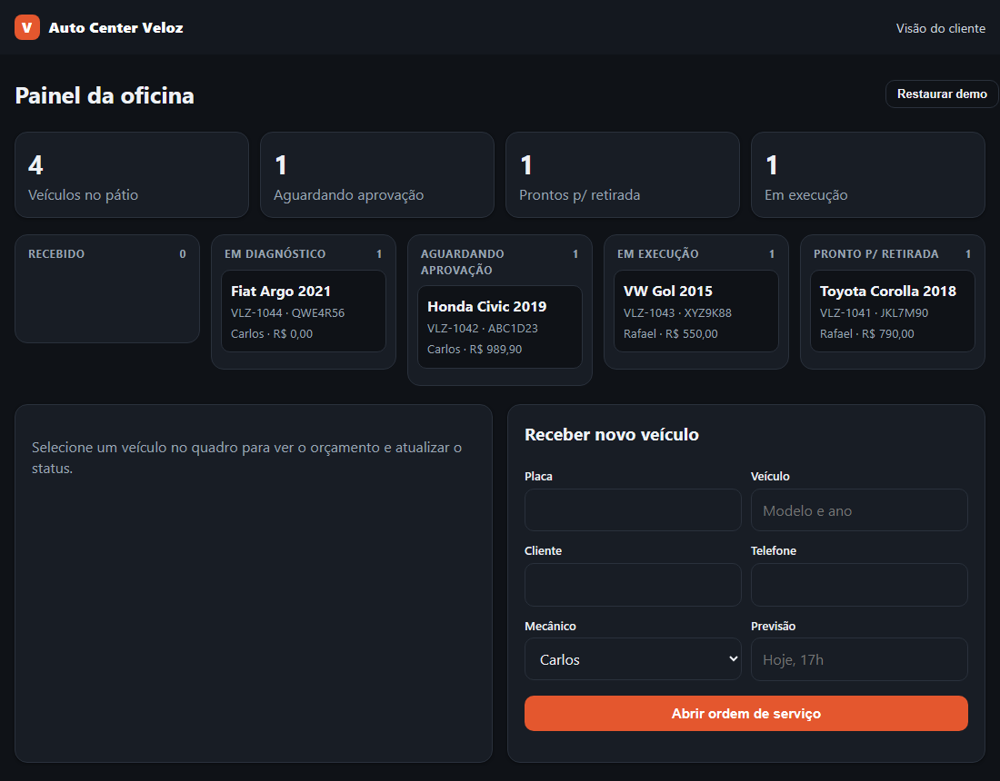

# Auto Center Veloz — Veloz Track:

Web app de acompanhamento de serviços e aprovação de orçamentos para a **Oficina e Auto Center Veloz**.
Projeto da disciplina de Design Profissional (Estudo de Caso 3).

**Demo publicada:** https://rennanjkw2019-coder.github.io/autocenter-veloz/

## 1. Briefing do problema:

A Auto Center Veloz é uma oficina com ótima reputação técnica (5 elevadores, 6 mecânicos, 2 recepcionistas), mas toda a comunicação com o cliente é feita por papel e telefone. Com a carteira de clientes crescendo, isso gerou:

- o telefone da recepção toca o dia todo com clientes querendo saber se o carro está pronto;
- mecânicos param o serviço para responder a recepção ou tirar foto de peça;
- clientes demoram horas para aprovar orçamentos, e o pátio fica lotado de carros parados esperando resposta;
- risco de avaliações negativas na internet por falha de comunicação.

**Oportunidade:** concessionárias oferecem relatórios digitais, mas cobram caro; oficinas pequenas são informais. A Veloz pode unir a confiança técnica que já tem a um canal rápido e transparente.

## 2. Por que um web app (e não app nativo ou site institucional)?

| Opção | Avaliação |
|---|---|
| Site institucional | Não resolve a dor: seria só vitrine, sem status nem aprovação. |
| App móvel nativo | O cliente precisaria baixar e criar conta para usar uma ou duas vezes. Alto atrito, custo de publicar nas lojas. |
| **Web app responsivo** ✅ | Abre por link/QR code no comprovante, sem instalar nada, funciona no celular do cliente e no computador da recepção. |

Decisão: **um web app com duas visões** que compartilham os mesmos dados:

1. **Visão do cliente** — consulta por placa + código da OS, vê a etapa do conserto, fotos das peças e **aprova/recusa cada item do orçamento** com um toque.
2. **Painel da oficina** — quadro por etapa, o mecânico atualiza o status e anexa foto da peça sem precisar ligar para a recepção.

Como isso resolve a dor: o cliente deixa de ligar (vê o status sozinho), a aprovação deixa de depender de ligação (reduz o tempo de carro parado) e o histórico com data/hora vira registro de transparência.

## 3. Protótipos / telas:

| Início | Cliente (celular) | Painel da oficina |
|---|---|---|
|  |  |  |

## 4. Arquitetura:

- **HTML + CSS + JavaScript puro**, sem framework e sem etapa de build (publica direto no GitHub Pages).
- `js/store.js`: camada de dados. Na demo usa `localStorage`; as abas se sincronizam pelo evento `storage`.
- `js/cliente.js` e `js/painel.js`: lógica de cada visão.
- `css/style.css`: estilos, responsivo (mobile first) e com tema escuro automático.
- Fotos de exemplo são SVGs gerados no código; no painel é possível anexar foto real, que é reduzida antes de salvar.

```
autocenter-veloz/
├── index.html      # página inicial
├── cliente.html    # visão do cliente
├── painel.html     # painel da oficina
├── css/style.css
├── js/             # store.js, cliente.js, painel.js
└── docs/           # imagens do README
```

**Limitação assumida:** como a demo não tem servidor, o painel e a visão do cliente só compartilham dados no mesmo navegador. Em produção, `Store` seria trocado por uma API com banco de dados, autenticação para a equipe e notificação por WhatsApp/SMS (próximos passos).

## 5. Como executar

Não há dependências. Opção 1: abrir `index.html` no navegador. Opção 2, com servidor local:

```bash
python -m http.server 8000
# acesse http://localhost:8000
```

Dados de demonstração: placa `ABC1D23`, código `VLZ-1042` (orçamento aguardando aprovação). O botão "Restaurar demo" no painel recarrega os dados.

## 6. Segurança

O projeto não usa chaves de API, senhas ou tokens. Todos os dados (nomes, placas, telefones) são fictícios. O `.gitignore` já bloqueia `.env`, chaves e `node_modules`.

## 7. Licença

[MIT](LICENSE)
